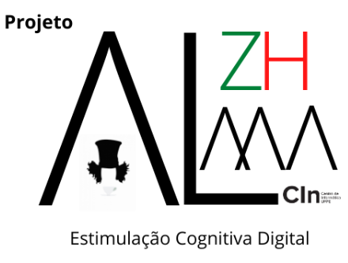
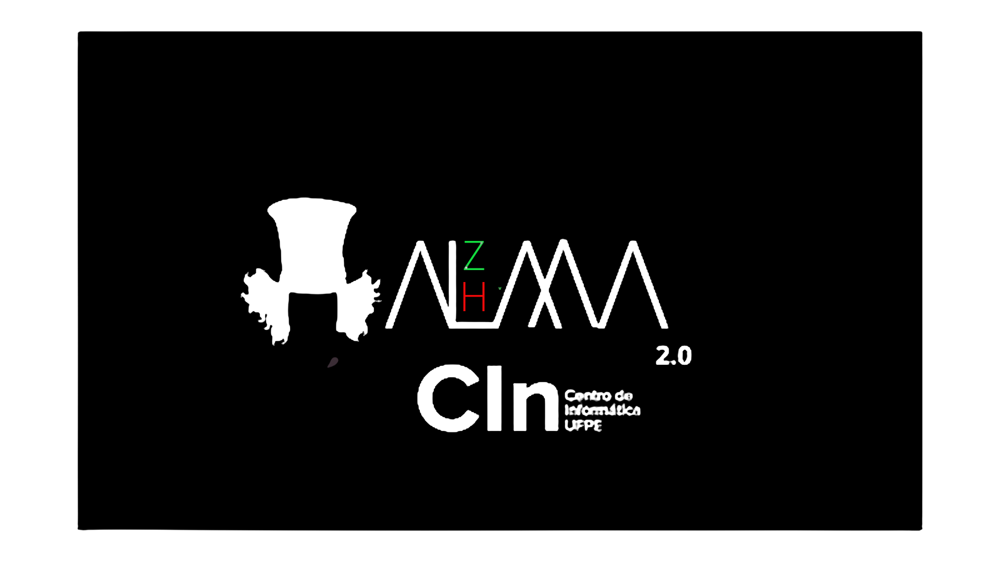
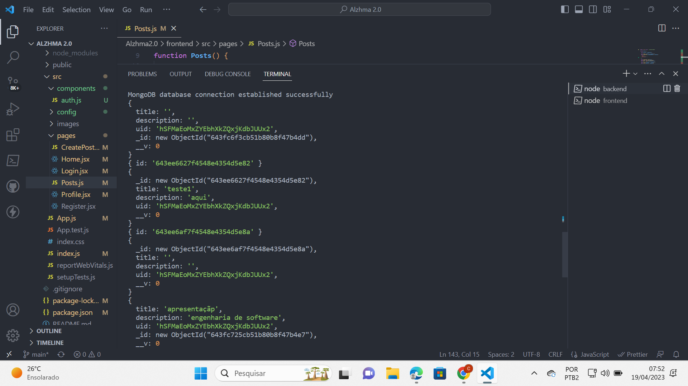

#  Projeto Alzhma 1.0

# The Alzhma Project 2.0 

## Código Fonte versão 2.0 -
* P.S: com o intuito de evitar confusão, decidimos dividir os códigos fontes das 2 versões em repositórios separados.
https://github.com/odontoblasto/Alzhma2.0

## Membros
* Carlos Eduardo D.F. de Vasconcellos (cedfv)
* Pedro Henrique Medeiros (phmfl)
* Leonardo Bezerra de Oliveira (lbo)

## Background
* Esse repositório possui o código-fonte e a documentação do projeto da Disciplina de Engenharia de Software (IF-977) ministrada pelo Professor Vinicius Garcia, do CIn/UFPE.

## Objetivo
* O objetivo do projeto é construir uma aplicação (no formato MVP), que seja capaz de estimular cognitiva e digitalmente, pessoas acometidas pela Doença de Alzheimer.

* Nossa aplicação se chama "The Alzhma Project 2.0" e pretende ser uma plataforma capaz de estimular a cognição e a memória de pessoas acometidas pela Doença de Alzheimer, podendo ser também utilizada por  pessoas com outros distúrbios de memória e cognição, por meio de atividades lúdicas.
* Sendo assim, nossa missão é tentar fornecer uma plataforma digital lúdica que promova melhorias tanto no quadro clínico ,como no emocional dos pacientes.

## Link para o projeto
* versão 1.0 - https://github.com/odontoblasto/ProjetoAlzhmareactjsmui 
* versão 2.0 - https://github.com/odontoblasto/Alzhma2.0

## Link para o vídeo de demonstração da plataforma (Screencast)
FALTA

## Explicações sobre decisões tomadas no decorrer do Projeto

* Tivemos muita dificuldade na criação do Projeto porque de forma indevida, "pensamos mais na solução no que no problema", já que a versão 1.0 estava enviesada por ter sido criada para um único "cliente". O projeto foi baseado na história familiar de um dos nossos integrantes que criou uma solução pessoal.
* Esse viés foi esclarecido pelo Professor na 1º reunião de alinhamento. Repensamos o problema e criamos uma versão,2.0, mais genérica e que serve de "backbone" para a criação de plataformas digitais lúdicas.
* Essas plataformas podem ser utilizadas em diversos distúrbios de cognição, memória e aprendizado.Porém, o viés encurtou o tempo disponível, mesmo tendo criado um MVP funcional, muitas "features" básicas ainda não estão funcionais.
* Mesmo utilizando o Github Co-Pilot, temos ciência que os Testes poderiam ter sido mais utilizados.Implementamos testes unitários dos elemntos HTML com Jest e Testing Library nativos, porém por falta de habilidade deixamos de utilizar o Cypress.
* De qualquer forma, criamos no código-fonte "breadcrops" que indicam nossa vontade e a possibilidade de melhoria para a versão 3.0 quando esperamos realizar todas as "features" básicas pensadas.
* Por fim, temos ciência que o primeiro passo foi dado, já que nosso projeto pode ser apresentado para os profissionais da Saúde que lidam com o público-alvo, e esses, contribuirão na composição final do projeto.
Essa contribuição definirá quais métricas e "features" avançadas devem ser implementadas.

## Mock-Up com Python

* No início do projeto, utilizamos Python na construção de um Mock-Up. Essa etapa, permitiu a visualização de quais "caminhos" e estruturas de dados deveriam ser utilizadas - Array,Dict, Objects - já que só conhecíamos Python. 
* https://github.com/odontoblasto/ProjetoAlzhmareactjsmui/tree/main/projeto/python

## MVP - visão geral

* Decidimos utilizar o protocolo MERN - MongoDB, Express, ReactJS e Node.Js.

### Front-End

* Como requisitado nas orientações de projeto da Disciplina, utilizamos HTML,CSS, JS e ReactJS como
bases da programação. A curva de aprendizado foi de +- 6 meses, sendo o aluno Carlos Eduardo, o principal agente do Front-End.
* Utilizamos também, BootStrap, ReactStrap, Material UI , como Libs para a construção do Layout das páginas e  Google Firebase como "3° Partie" na autenticação de usuário.

### Back-End

* Utilizamos Node.Js como base do Back-End, sendo o aluno Leonardo Bezerra seu principal agente. A curva de aprendizado foi de +- 4 meses.
* Integramos Front/Back com Axios, quando usamos a "Programação em Par"- Carlos e Leonardo.
* A integração Back/BD, realizada com Cors e Express, foi realizada com "Programação em Par' - Leonardo e Pedro. 

### BD

* Como BD, foi utilizado MongoDb Atlas pela familiaridade do aluno Pedro, DBA do projeto. Fomentamos a possibilidade de mudança para FireStoreDataBase, porém por medo de "Bug" no última etapa, adiamos esse debate para a versão 3.0. 

#### Modelo ER - Alzhma 2.0

### Ferramentas utilizadas no Projeto
* Javascript
* React JS
* Python
* HTML
* CSS
* Bootstrap 
* MUI
* Node.js
* Axios
* Express.js
* Jest
* Cors
* Firebase
* MongoDB Atlas

### Escolha de ferramenta para deploy
* Optamos por usar o Google Firebase por sua simplicidade e facilidade e pelo fato de nenhum dos integrantes da equipe possuir experiência prévia em deploy.

## Screenshots

### Página Inicial

### Página de Login

### Página de Criação de Perguntas e Resposta

### Página do Quiz

### Página do Quiz Update Question or Answer- Modal

### Página do Auth Google FireBase

### Página do Backend

### Página do MongoDb Atlas

### Página Testes Jest

### Página Deploy Firebase Console

### Página Deploy Firebase Home

## Referências utilizadas na elaboração do projeto

* https://github.com/IF977/if977 ( Repositório da cadeira de Engenharia de Software )
* https://www.youtube.com/watch?v=MpQbwtSiZ7E ( MERN Protocol )
* https://www.youtube.com/watch?v=x9tC0eK0GtA ( MongoDB Atlas )
* https://www.youtube.com/watch?v=bMknfKXIFA8 ( React JS tutorial )
* https://www.youtube.com/watch?v=p1bjHvX-DqM&t=1293s ( Teste Jest tutorial )
* https://www.youtube.com/watch?v=9bXhf_TELP4&t=1044s ( Auth Firebase )
* https://www.youtube.com/watch?v=2hR-uWjBAgw&t=5320s ( Deploy Firebase )
* https://www.portal.ufpa.br/index.php/ultimas-noticias2/9545-aplicativo-desenvolvido-na-ufpa-ajuda-no-tratamento-de-alzheimer-em-idosos ( App Alzheimer UFPA )
